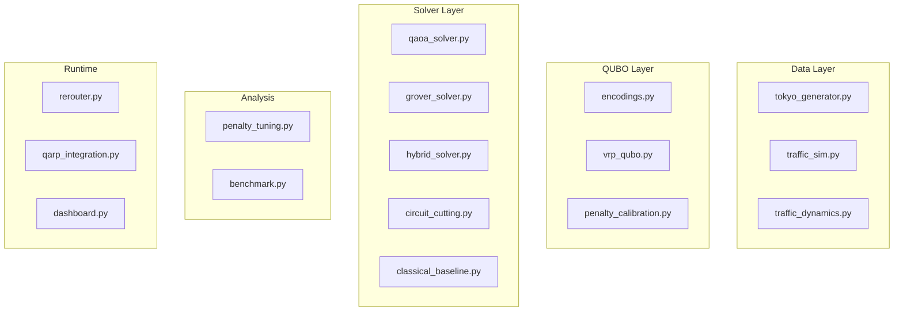

# Quantum VRP — Final Walkthrough

## Summary

All feasible items for the Fujitsu Quantum Simulator Challenge are complete. **81/81 tests pass** in 39.58s across 5 test files.

## Architecture

## What Was Built

| Phase | File | Purpose |
|-------|------|---------|
| 0 | [encodings.py](file:///home/mujahid/logistic/src/qubo/encodings.py) | Position + Route QUBO encodings |
| 0 | [vrp_qubo.py](file:///home/mujahid/logistic/src/qubo/vrp_qubo.py) | QUBO builder, Ising conversion |
| 1 | [qaoa_solver.py](file:///home/mujahid/logistic/src/solvers/qaoa_solver.py) | QAOA via numpy/scipy |
| 1 | [classical_baseline.py](file:///home/mujahid/logistic/src/solvers/classical_baseline.py) | OR-Tools + brute-force |
| 2 | [tokyo_generator.py](file:///home/mujahid/logistic/src/data/tokyo_generator.py) | Shibuya road network |
| 2 | [traffic_dynamics.py](file:///home/mujahid/logistic/src/routing/traffic_dynamics.py) | Lyapunov exponents 🔥 |
| 2 | [traffic_sim.py](file:///home/mujahid/logistic/src/routing/traffic_sim.py) | Disruption events |
| 2 | [hybrid_solver.py](file:///home/mujahid/logistic/src/solvers/hybrid_solver.py) | K-means + quantum + 2-opt |
| 2 | [penalty_tuning.py](file:///home/mujahid/logistic/src/analysis/penalty_tuning.py) | Penalty sweep + success prob |
| 3 | [grover_solver.py](file:///home/mujahid/logistic/src/solvers/grover_solver.py) | Grover Adaptive Search |
| 4 | [rerouter.py](file:///home/mujahid/logistic/src/routing/rerouter.py) | Real-time re-routing |
| 4 | [circuit_cutting.py](file:///home/mujahid/logistic/src/solvers/circuit_cutting.py) | 40-qubit scaling |
| 4 | [qarp_integration.py](file:///home/mujahid/logistic/src/solvers/qarp_integration.py) | QARP SDK layer |
| 5 | [benchmark.py](file:///home/mujahid/logistic/src/benchmark.py) | 6-solver comparison |
| 5 | [dashboard.py](file:///home/mujahid/logistic/src/dashboard.py) | Streamlit dashboard |
| 5 | [qarp_feedback.md](file:///home/mujahid/logistic/docs/qarp_feedback.md) | SDK feedback |
| 5 | [final_presentation.md](file:///home/mujahid/logistic/docs/final_presentation.md) | Competition submission |

## Test Results — 81/81 ✅

| Test File | Tests | Focus |
|-----------|-------|-------|
| [test_qubo.py](file:///home/mujahid/logistic/tests/test_qubo.py) | 14 | Encodings, QUBO, Ising |
| [test_solvers.py](file:///home/mujahid/logistic/tests/test_solvers.py) | 4 | Classical baselines |
| [test_grover.py](file:///home/mujahid/logistic/tests/test_grover.py) | 10 | Grover, QAOA→GAS |
| [test_phase2.py](file:///home/mujahid/logistic/tests/test_phase2.py) | 21 | Tokyo, Traffic, Hybrid |
| [test_penalty_tuning.py](file:///home/mujahid/logistic/tests/test_penalty_tuning.py) | 13 | Penalty sweep, 4-stop VRP |
| [test_phase4.py](file:///home/mujahid/logistic/tests/test_phase4.py) | 14 | Re-routing, Circuit cutting |
| **Total** | **81** | **39.58s** |

## Remaining (Hardware-Dependent)

- **MPS benchmarks** — Needs Fujitsu QARP simulator for tensor-network parameter sweeps
- **8-stop VRP** — Circuit cutting infrastructure ready, needs 40-qubit simulator
